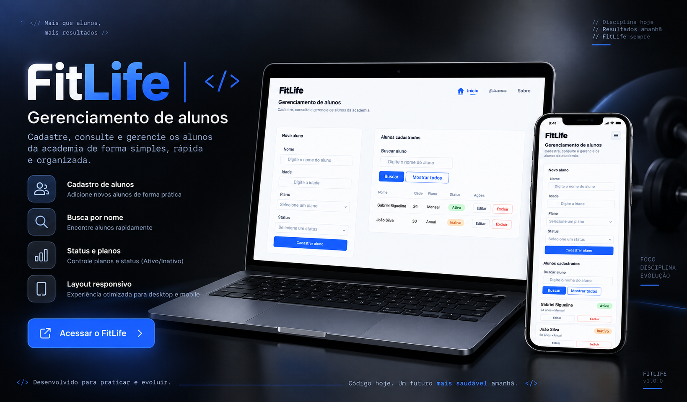

# 🏋️ FitLife

Sistema de gerenciamento de alunos de academia desenvolvido para praticar
HTML, CSS, JavaScript, responsividade e conceitos de CRUD.

## 🚀 Projeto online

🔗 [Acesse o FitLife](https://bigueline.github.io/FitLife/)

## 🖼️ Preview

## 💻 Funcionalidades

- Cadastro de alunos
- Edição de alunos
- Exclusão de alunos
- Busca por nome
- Status Ativo/Inativo
- Persistência de dados com localStorage
- Layout responsivo para desktop e mobile

## 🛠️ Tecnologias

- HTML5
- CSS3
- JavaScript
- LocalStorage
- Git e GitHub
- Figma

## 📱 Responsividade

A interface foi planejada no Figma e adaptada para diferentes tamanhos de tela.

No desktop, os alunos são apresentados em uma listagem organizada por colunas.

No mobile, cada aluno é apresentado em um card responsivo com suas informações
e ações de edição e exclusão.

## 🎯 Objetivo do projeto

O FitLife foi desenvolvido durante meus estudos de Análise e Desenvolvimento
de Sistemas com o objetivo de colocar em prática conceitos de desenvolvimento
web, lógica de programação, CRUD, persistência de dados, UI/UX e
responsividade.

## 📚 Aprendizados

Durante o desenvolvimento pratiquei:

- Manipulação do DOM
- Arrays e objetos em JavaScript
- Funções e eventos
- Validação de formulários
- CRUD
- localStorage
- Busca com `filter()`
- Reutilização de código
- Flexbox
- Media Queries
- UI/UX com Figma
- Git e GitHub

## 👨‍💻 Autor

Desenvolvido por Gabriel Bigueline.

## 🔜 Próximos passos

O FitLife continuará evoluindo.

Uma versão 2 está planejada para o futuro, trazendo melhorias na experiência,
novas funcionalidades e evolução da aplicação.

Este projeto representa a primeira versão construída durante meu processo
de aprendizado e desenvolvimento.